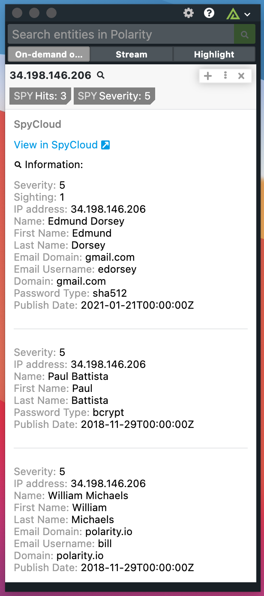

# Polarity SpyCloud Integration

SpyCloud Employee Account Takeover Prevention enables enterprises to stay ahead of account takeover and targeted attacks like ransomware by detecting and resetting compromised passwords early, before criminals have a chance to use them.

The Polarity SpyCloud integration searches the SpyCloud API for Watchlist Asset Breach data for Domains, Email, and IPs.

To learn more about SpyCloud, please visit: https://spycloud.com/

## SpyCloud Integration Options

### SpyCloud API URL

The Spycloud API url used to search information about malicious indicators.

### SpyCloud API Key

The Spycloud API that can be found in the SpyCloud dashboard, under Main -> API

### Max Concurrent Search Requests

Maximum number of concurrent search requests (defaults to 20). Integration must be restarted after changing this option.

### Minimum Time Between Searches

Minimum amount of time in milliseconds between each entity search (defaults to 100). Integration must be restarted after changing this option.

## Installation Instructions

Installation instructions for integrations are provided on the [PolarityIO GitHub Page](https://polarityio.github.io/).

## Polarity

Polarity is a memory-augmentation platform that improves and accelerates analyst decision making. For more information about the Polarity platform please see:

https://polarity.io/

